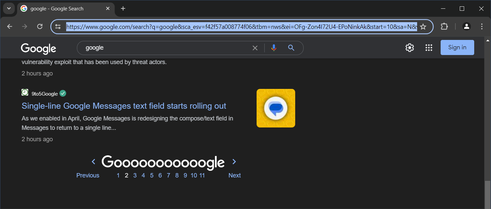

# **Google News Scraper**

Library that helps make it easier to scrape many links from Google News and extract all the text/content. Created using Selenium and Newspaper3k libraries.

This library was created because I wanted to share the code I had created with other people, as well as helping me learn more about the structure of the library and how to create it.

# **Function**

There are 5 functions that I provide in this library, the first two are used for link scraping.
```python
from google_news_scraper import scrape_google_news_link
from google_news_scraper import save_link_to_csv

scrape_google_news_link(result_set: set, url: str, number: int = 100) -> bool
save_link_to_csv(output_file: str, link_set: set, sort: bool = True, asc: bool = False) -> None
```

While the rest is used for scraping the content of all links.
```python
from google_news_scraper import scrape_article_content
from google_news_scraper import save_content_to_csv
from google_news_scraper import save_content_to_excel

scrape_article_content(csv: str, lang: str = 'id') -> tuple[dict, list]
save_content_to_csv(output_file: str, content_dict: dict) -> None
save_content_to_excel(output_file: str, content_dict: dict) -> None
```

# **Get Started**

## **Get Google News Link**
The Google News used in this library is Google News on the main Google search engine. To get the link:

1. Search something on Google
2. Select the News menu
3. Scroll to the bottom and click page 2
4. Copy the link in the address bar
5. Then enter it into the `scrape_google_news_link()` function



## **How to Install**
To install the latest version of this library, please use the following command.
```shell
pip install git+https://github.com/bayu-siddhi/google-news-scraper.git
```
For details, please see the following website https://pip.pypa.io/en/stable/topics/vcs-support/.

## **Run in Google Colab**
To be able to run this library on Google Colab, please install the Firefox driver using the following command.
```shell
!apt install firefox
```

## **Scrape Google News Link**
The following is how to scrape links from Google News and save them into a CSV file.
```python
from google_news_scraper import scrape_google_news_link
from google_news_scraper import save_link_to_csv

result_set = set()
target_link = 100
url = 'https://www.google.com/search?q=google&sca_esv=f42f57a008774f06&tbm=nws&sxsrf=ADLYWIIOa1LwmQXOZFfcJBvjpuNHS4ARMA:1715359197352&ei=3U0-ZvuIFYCd4-EPq6Sr0Ac&start=10&sa=N&ved=2ahUKEwi76_r8woOGAxWAzjgGHSvSCnoQ8tMDegQIBBAE&biw=1528&bih=716&dpr=1.25'
scrape_status = scrape_google_news_link(result_set, url, target_link)

output_file = 'results.csv'
save_link_to_csv(output_file, result_set)
```

The console output.
```commandline
https://www.google.com/search?q=google
Scraping article 1 to 10
Scraping article 11 to 20
Scraping article 21 to 30
Scraping article 31 to 40
Scraping article 41 to 50
Scraping article 51 to 60
Scraping article 61 to 70
Scraping article 71 to 80
Scraping article 81 to 90
Scraping article 91 to 100
Scraping article 101 to 110
Successfully got a total of 100 unique article links
----------------------------------------------------
```

The `results.csv` output.

```text
url,date
https://www.inews.id/techno/internet/trik-gunakan-google-circle-to-search-di-iphone-metode-cepat-mencari-informasi,2024-05-10
https://thehackernews.com/2024/05/malicious-android-apps-pose-as-google.html,2024-05-10
https://www.businessinsider.com/google-microsoft-ai-demis-hassabis-mustafa-suleyman-deepmind-history-relationship-2024-5,2024-05-10
https://id.beincrypto.com/openai-ingin-saingi-search-engine-google-harga-worldcoin-wld-naik-10-persen/,2024-05-10
https://www.cnbc.com/video/2024/05/09/openai-plans-to-announce-competitor-to-google-search-according-to-reuters.html,2024-05-10
https://www.ayojakarta.com/bisnis/7612631578/tips-android-cara-agar-google-tak-lagi-nguping-pembicaraanmu-sudah-tahu,2024-05-10
https://www.mediadangdut.com/2024/05/openai-mengatakan-pihaknya-berencana-meluncurkan-pesaing-pencarian-google-pada-13-mei/,2024-05-10
https://www.engadget.com/google-just-patched-the-fifth-zero-day-exploit-for-chrome-this-year-153723334.html,2024-05-10
https://www.gsmarena.com/rumor_openai_set_to_launch_its_own_search_engine_to_complement_chatgpt-news-62811.php,2024-05-10
...
```

You can also scrape links with multiple Google News keywords, and save them in one result. The method is to use the same `result_set` when running the second `scrape_google_news_link()`.

```python
from google_news_scraper import scrape_google_news_link
from google_news_scraper import save_link_to_csv

result_set = set()
target_link = 5

# Google News with the keyword 'google'
url = 'https://www.google.com/search?q=google&sca_esv=f42f57a008774f06&tbm=nws&sxsrf=ADLYWIIOa1LwmQXOZFfcJBvjpuNHS4ARMA:1715359197352&ei=3U0-ZvuIFYCd4-EPq6Sr0Ac&start=10&sa=N&ved=2ahUKEwi76_r8woOGAxWAzjgGHSvSCnoQ8tMDegQIBBAE&biw=1528&bih=716&dpr=1.25'
scrape_google_news_link(result_set, url, target_link)

# Google News with the keyword 'openai'
url = 'https://www.google.com/search?q=openai&sca_esv=f42f57a008774f06&tbm=nws&ei=YlE-Zrj0BaiC4-EP9cOAgAk&start=10&sa=N&ved=2ahUKEwi4rbyqxoOGAxUowTgGHfUhAJAQ8tMDegQIBhAE&biw=1536&bih=738&dpr=1.25'
scrape_google_news_link(result_set, url, target_link)

output_file = 'results.csv'
save_link_to_csv(output_file, result_set)
```

The console output.

```commandline
https://www.google.com/search?q=google
Scraping article 1 to 10
Successfully got a total of 5 unique article links
--------------------------------------------------
https://www.google.com/search?q=openai
Scraping article 1 to 10
Successfully got a total of 10 unique article links
---------------------------------------------------
```

The `results.csv` output.

```text
url,date
https://www.jagatreview.com/2024/05/karyawan-google-tak-senang/,2024-05-10
https://teknologi.bisnis.com/read/20240510/84/1764221/google-wallet-mulai-beroperasi-di-india-jalin-kerja-sama-dengan-20-merek-lokal,2024-05-10
https://infokomputer.grid.id/read/124082990/openai-luncurkan-fitur-akses-riwayat-dan-chat-sementara-di-chatgpt,2024-05-10
https://jabar.viva.co.id/kipedia/22905-ayo-dapatkan-saldo-dana-gratis-rp-750000-dari-google-menanti-anda,2024-05-10
https://padek.jawapos.com/gaya-hidup/2364636664/waspada-google-diam-diam-merekam-suara-anda-begini-cara-menonaktifkannya,2024-05-10
https://id.beincrypto.com/openai-ingin-saingi-search-engine-google-harga-worldcoin-wld-naik-10-persen/,2024-05-10
https://katadata.co.id/digital/teknologi/663d6c8d1946b/openai-akan-umumkan-mesin-pencarian-berbasis-ai-pesaing-google,2024-05-10
https://tekno.sindonews.com/read/1373947/207/spesifikasi-model-openai-urai-prinsip-aturan-dasar-penggunaan-ai-1715245556,2024-05-10
https://id.techinasia.com/rangkuman-kabar-startup-teknologi-10-mei-2024,2024-05-10
https://www.yangcanggih.com/2024/05/10/nvidia-chatrtx/,2024-05-10
```

## **Scrape Google News Text / Content**
The following is how to get the text or content of all the links in `results.csv` which were successfully obtained using the previous method, and save the results in CSV and EXCEL files.

```python
    from google_news_scraper import scrape_google_news_link
    from google_news_scraper import save_link_to_csv
    from google_news_scraper import scrape_article_content
    from google_news_scraper import save_content_to_csv
    from google_news_scraper import save_content_to_excel

    result_set = set()
    target_link = 5
    url = 'https://www.google.com/search?q=openai&sca_esv=f42f57a008774f06&tbm=nws&ei=YlE-Zrj0BaiC4-EP9cOAgAk&start=10&sa=N&ved=2ahUKEwi4rbyqxoOGAxUowTgGHfUhAJAQ8tMDegQIBhAE&biw=1536&bih=738&dpr=1.25'
    scrape_status = scrape_google_news_link(result_set, url, target_link)

    output_file = 'results.csv'
    save_link_to_csv(output_file, result_set)

    news_dict, status_list = scrape_article_content('results.csv', lang='id')

    save_content_to_csv('content.csv', news_dict)
    save_content_to_excel('content.xlsx', news_dict)
```

The console output.

```commandline
https://www.google.com/search?q=openai
Scraping article 1 to 10
Successfully got a total of 5 unique article links
--------------------------------------------------
1 [success] https://id.techinasia.com/rangkuman-kabar-startup-teknologi-10-mei-2024
2 [success] https://tekno.sindonews.com/read/1373947/207/spesifikasi-model-openai-urai-prinsip-aturan-dasar-penggunaan-ai-1715245556
3 [success] https://id.beincrypto.com/openai-ingin-saingi-search-engine-google-harga-worldcoin-wld-naik-10-persen/
4 [success] https://katadata.co.id/digital/teknologi/663d6c8d1946b/openai-akan-umumkan-mesin-pencarian-berbasis-ai-pesaing-google
5 [success] https://infokomputer.grid.id/read/124082990/openai-luncurkan-fitur-akses-riwayat-dan-chat-sementara-di-chatgpt
status
success	5
failed	0
```

The `news_dict` output.

```python
{0: {'title': 'Spesifikasi Model OpenAI Urai Prinsip Aturan Dasar Penggunaan AI',
  'url': 'https://tekno.sindonews.com/read/1373947/207/spesifikasi-model-openai-urai-prinsip-aturan-dasar-penggunaan-ai-1715245556',
  'text': 'Spesifikasi Model OpenAI Urai Prinsip Aturan Dasar Penggunaan AI\n\nloading...\n\nOpenAI Urai Prinsip Aturan Dasar Penggunaan AI. FOTO/ CNET\n\n(wbs)\n\n- Spesifikasi Model OpenAI, sebuah kerangka kerja yang baru dirilis, bertujuan untuk menetapkan seperangkat aturan dasar untuk perilaku AI.Hal ini didorong oleh kekhawatiran tentang potensi AI untuk berperilaku tidak etis atau berbahaya, seperti yang terlihat dalam kasus Bing AI milik Microsoft dan generator gambar Gemini Google.Model AI harus dirancang untuk membantu pengguna mencapai tujuan mereka dengan memberikan tanggapan yang bermanfaat dan mengikuti instruksi.Model AI harus dikembangkan dengan mempertimbangkan potensi manfaat dan kerugian bagi masyarakat luas.Model AI harus selaras dengan norma dan hukum sosial, serta nilai-nilai OpenAI.Spesifikasi Model bukan hanya daftar aturan yang kaku, tetapi juga kerangka kerja yang fleksibel untuk memandu pengembangan dan penggunaan AI yang bertanggung jawab. Ini termasuk panduan untuk:Memahami Tujuan dan Nilai, memastikan bahwa model AI memahami tujuan dan nilai pengguna dan pemangku kepentingan lainnya.Menangani Kompleksitas, mengatasi tantangan dalam mengembangkan model AI yang dapat menangani situasi dunia nyata yang kompleks.Memastikan Keamanan dan Legalitas, menerapkan pengamanan untuk mencegah model AI digunakan untuk tujuan berbahaya atau melanggar hukum.Spesifiksi Model OpenAI merupakan langkah penting dalam mengembangkan AI yang lebih aman, andal, dan bermanfaat bagi semua orang.Dengan menyediakan kerangka kerja yang jelas untuk pengembangan dan penggunaan AI, OpenAI membantu memajukan masa depan AI yang bertanggung jawab.',
  'date': '2024-05-10',
  'tags': 'open ai, chatgpt, artificial intelligence ai, sains, OpenAI ,, kecerdasan buatan'},
 1: {'title': 'OpenAI akan Umumkan Mesin Pencarian Berbasis AI, Pesaing Google',
  'url': 'https://katadata.co.id/digital/teknologi/663d6c8d1946b/openai-akan-umumkan-mesin-pencarian-berbasis-ai-pesaing-google',
  'text': 'OpenAI dikabarkan akan mengumumkan mesin pencarian atau search engine yang didukung kecerdasan buatan atau artificial intelligent (AI) pada awal pekan depan. Produk ini akan menjadi pesaing baru Raja Pencarian, Google.\n\nMelansir Reuters, Jumat (10/5), pengumuman tersebut mungkin dilakukan sehari sebelum konferensi I/O tahunan Google pada Selasa, 14 Mei 2024. Google diperkirakan juga akan mengungkap sejumlah produk terkait AI.\n\nMesin pencarian OpenAI merupakan perpanjangan produk andalannya, yaitu ChatGPT yang dapat menarik langsung informasi dari situs dan menyertaakan kutipan. ChatGPT adalah produk chatbot yang memakai model AI teranyar milik perusahaan untuk menghasilkan respon mirip manusia terhadap perintah teks.\n\nChatGPT merupakan aplikasi tercepat yang pernah mencapai 100 juta pengguna aktif bulanan sejak dilucurkan pada akhir 2022. Lalu lintas situsnya mengalami peningkatan dalam satu terakhir dengan punckanya pada Mei 2023. Perusahaan kini berada dalam tekanan untuk memperluas basis pengguna.\n\nPara ahli dan pengamat industri telah lama menyebut ChatGPT sebagai alternatif dalam mengumpulkan informasi secara daring atau online. Tapi mesin ini masih memiliki kekurangan dalam menyediakan informasi secara akurat dan real-time dari situs.\n\nBloomberg melaporkan, OpenAI yang didukung Microsoft sedang mengerjakan produk pencarian yang berpotensi bersaing dengan Google milik Alphabet. Pesaing lainnya adalah Perplexity, sebuah startup pencarian berbasis AI yang dapat menyajikan informasi secara real-time.',
  'date': '2024-05-10',
  'tags': '#Google, #OpenAI, #Artificial Intelligence, OpenAI, #ChatGPT, #Kecerdasan Buatan, AI, #AI, Google, #Update Me'},
 2: {'title': 'OpenAI Luncurkan Fitur Akses Riwayat dan Chat Sementara di ChatGPT',
  'url': 'https://infokomputer.grid.id/read/124082990/openai-luncurkan-fitur-akses-riwayat-dan-chat-sementara-di-chatgpt',
  'text': 'OpenAI Luncurkan Fitur Akses Riwayat dan Chat Sementara di ChatGPT\n\nOpenAI akan menghadirkan fitur obrolan sementara di web ChatGPT dan menyusul segera di HP. OpenAI terus meningkatkan pengalaman pengguna dengan pembaruan yang fokus pada kontrol data dan kebutuhan pengguna.\n\nPembaruan terbaru OpenAI itu membawa dua fitur utama. Yang pertama adalah \'Akses Riwayat Obrolan Lengkap\', yang sebelumnya tidak tersedia bagi pengguna yang memilih untuk tidak menyumbangkan data percakapan mereka. Pembaruan ini memperbolehkan semua pengguna untuk mengakses riwayat obrolan mereka tanpa memandang preferensi kontribusi data mereka.\n\nFitur kedua adalah \'Obrolan Sementara\', yang memungkinkan pengguna berinteraksi dengan ChatGPT secara singkat dan pribadi tanpa menyimpan percakapan dalam riwayat. Saat ini, pembaruan ini telah diluncurkan di versi web ChatGPT, sementara versi aplikasi seluler akan segera menyusul.\n\nPembaruan ini menegaskan komitmen OpenAI terhadap pendekatan yang berfokus pada pengguna dengan memberikan lebih banyak kontrol atas riwayat obrolan, menghormati preferensi kontribusi data, dan memperkenalkan fitur untuk meningkatkan privasi.\n\nSelain itu, OpenAI juga memperluas fitur \'Memori\' kepada pelanggan ChatGPT Plus, yang memungkinkan chatbot untuk mengingat informasi yang berguna untuk merumuskan jawaban di masa depan, seperti konteks dari percakapan sebelumnya.\n\nFitur Memory\n\nChatGPT Plus\n\nOpenAI baru saja meluncurkan fitur Memory untuk pengguna ChatGPT Plus di dunia kecuali pasar Eropa dan Korea. Fitur itu akan mengingat dan mengenali preferensi pengguna saat berinteraksi dengan chatbot. Hal itu membuat pengguna tidak perlu menuliskan preferensinya secara berulang ketika berinteraksi dengan chatbot soal hal serupa.\n\nFitur itu mampu membuat respons chatbot menjadi lebih personal dengan cara mengingat detail yang relevan dari percakapan sebelumnya. Pengguna dapat mengontrol apa yang disimpan dan diingat oleh ChatGPT, serta dapat mematikan fitur ini atau menghapus ingatan secara manual. Fitur ini juga tersedia untuk pelanggan ChatGPT Team dan Enterprise untuk menghasilkan respons yang lebih relevan dan efisien sesuai dengan gaya dan preferensi pengguna.\n\nOpenAI mengatakan pengguna tetap memiliki kendali atas apa yang disimpan dan diingat ChatGPT (dan apa yang digunakan untuk pelatihan tambahan). Pengguna dapat mematikan fitur memory kapan saja dengan cara klik "Settings" > "Personalization" > "Memory". Saat memori mati, pengguna ChatGPT Plus tidak akan membuat atau menggunakan memori.\n\nJika ingin ChatGPT melupakan sesuatu, pengguna tinggal berikan perintah. Pengguna juga dapat melihat dan menghapus kenangan tertentu atau menghapus semua ingatan dalam pengaturan. Caranya "Settings" > "Personalization" > "Manage Memory". OpenAI mengatakan, ingatan ChatGPT berkembang seiring interaksi pengguna dan tidak terkait dengan percakapan tertentu.\n\nBaca Juga: Apple Bikin Chip Spesial Dorong Kemampuan AI di Data Center\n\nPROMOTED CONTENT\n\nVideo Pilihan',
  'date': '2024-05-10',
  'tags': '#chatgpt, #lk21, #danabijak, #cara Download Lagu Mp3, ChatGPT, #apple Vision Pro, #bhimo Wikan Hantoro, #download Lagu, #aplikasi Download Video Tiktok, OpenAI, #contoh Artificial Intelligence, #pinjol Ilegal'},
 3: {'title': 'OpenAI Akan Rilis Search Engine Pesaing Google, Harga Worldcoin (WLD) Naik 10%',
  'url': 'https://id.beincrypto.com/openai-ingin-saingi-search-engine-google-harga-worldcoin-wld-naik-10-persen/',
  'text': 'Harga native token Worldcoin (WLD), yang terafiliasi dengan Sam Altman, sempat melonjak sekitar 10% dalam 24 jam terakhir usai muncul kabar OpenAI berniat meluncurkan search engine pesaing Google.\n\nAdapun OpenAI berencana mengumumkan produk search engine mereka yang didukung artificial intelligence (AI) pada hari Senin mendatang, tanggal 13 Mei.\n\nInformasi ini pertama kali dilaporkan oleh Reuters pada hari Jumat (10/5), mengutip 2 sumber yang mengetahui persoalan ini.\n\nBloomberg dan The Information telah melaporkan bahwa OpenAI yang didukung Microsoft sedang mengerjakan produk search engine yang berpotensi bersaing dengan Google milik Alphabet dan Perplexity, sebuah startup search engine berbasis AI.\n\nPengumuman produk search engine OpenAI mungkin dilakukan sehari sebelum dimulainya konferensi I/O tahunan Google pada hari Selasa mendatang, tanggal 14 Mei. Dalam kesempatan ini, Google diperkirakan akan mengungkapkan sejumlah produk terkait AI.\n\nSearch engine OpenAI merupakan perpanjangan dari produk andalan ChatGPT, dan memungkinkan chatbot bertenaga AI itu menarik informasi langsung dari internet dan menyertakan kutipan.\n\nDisponsori Disponsori\n\nPengamat industri telah lama menyebut ChatGPT sebagai alternatif untuk mengumpulkan informasi online, meskipun mereka kesulitan menyediakan informasi yang akurat dan real-time dari internet.\n\nSebelumnya, OpenAI menjalin kerja sama dengan Microsoft untuk menghadirkan kemampuan ChatGPT dikombinasikan dengan search engine Bing. Dalam perkembangannya, Copilot buatan Microsoft menjadi aplikasi asisten berbasis AI yang memberikan informasi real-time dengan mengutip beberapa sumber internet.\n\nBaca Juga: Worldcoin Digadang Bakal Kolaborasi dengan OpenAI\n\nHubungan Sam Altman dan Worldcoin\n\nMerespon booming AI, proyek Worldcoin mencoba memecahkan 2 masalah, seperti otentikasi identitas online dan ketidaksetaraan pendapatan.\n\nDisponsori Disponsori\n\nSam Altman, selaku co-founder dan CEO OpenAI, menggunakan momentum AI untuk membujuk para investor agar mengucurkan pendanaan ke Tools for Humanity (TfH), sebuah perusahaan di balik Worldcoin yang dia dukung.\n\nPada Mei 2023, Worldcoin mengumumkan berhasil mendapat suntikan investasi senilai US$115 juta.\n\nNative token WLD diberikan sebagai imbalan bagi partisipan yang rela memindai iris mata mereka dengan perangkat yang disebut Orb. Pemindaian iris ini memastikan bahwa setiap orang hanya dapat memiliki satu World ID.\n\nID unik tersebut dapat digunakan untuk membedakan orang sungguhan dari bot. Adapun hal ini dinilai merupakan masalah yang semakin mendesak di era booming AI.\n\nWorld ID diharapkan bisa membantu mengurangi atau menghilangkan penipuan jika dan ketika pemerintah memutuskan untuk mendistribusikan pendapatan dasar universal (universal basic income atau UBI) kepada rakyatnya.\n\nSam Altman telah lama menjadi pendukung UBI sebagai cara untuk memerangi ketimpangan pendapatan. Dia memberi tahu para investor dalam proyek Worldcoin bahwa AI dapat memperburuk masalah ketimpangan, termasuk potensi kehilangan pekerjaan.\n\nBagaimana pendapat Anda tentang topik ini? Yuk, sampaikan pendapat Anda di grup Telegram kami. Jangan lupa follow akun Instagram dan Twitter BeInCrypto Indonesia, agar Anda tetap update dengan informasi terkini seputar dunia kripto.',
  'date': '2024-05-10',
  'tags': 'Indonesia'},
 4: {'title': 'Rumor mesin pencari milik OpenAI, divestasi aCommerce, dan lainnya',
  'url': 'https://id.techinasia.com/rangkuman-kabar-startup-teknologi-10-mei-2024',
  'text': "Baca 5 menit sehari untuk update industri startup terkini\n\nDaftar gratis By signing up, I agree to Tech in Asia's Terms of Service and Privacy Policy.\n\nKhusus buat kamu yang super sibuk, dapatkan semua informasi terpenting harian seputar industri startup, teknologi, dan profesional - kami kirim langsung ke inbox kamu.",
  'date': '2024-05-10',
  'tags': ''}}
```

# **Important Notes**

- The number of links that can be retrieved depends on the total number of links displayed by Google News. If you want to scrape as much as possible, please enter the argument `number=1000`. There will be no exception that appears if exactly 1000 links are not successfully obtained
- Not all links can be retrieved for their text/content due to restrictions on the website link. So the `scrape_news_text()` function does not always produce 100% successful output.
- The reliability of this code in extracting text/content from each link is very dependent on the capabilities of the Newspaper3k library.
- Until now, it has only been a year since I learned the Python programming language, so I realize there are many shortcomings in this code. So I will keep trying to improve and develop this code.
